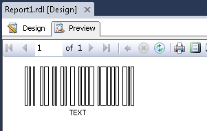

{} 

This help topic briefs the way to display barcode with empty bars.

{} 

In Visual Studio, users can use the image control to render barcode images using Aspose.BarCode for Reporting Services APIs.
### **Create Barcode with Empty Bars**
#### **Add a reference of the Aspose.BarCode.ReportingServices.dll**
1. Select report in solution explorer.
1. In Visual Studio main menu, Select **Report** and then **Report Properties**.
1. Click the **References** tab.
1. Browse to the Aspose.BarCode.ReportingServices.dll and add it to the references.
1. A reference to System.Drawing dll is also required, which can be found in the .NET tab.
1. In **Add or remove classes** part, add the description for the class as follows:
   Class Name:Aspose.BarCode.ReportingServices.BarCodeBuilder Instance Name: objBarCode
1. Click on the **OK** button.
#### **Add the source code**
1. Select report in solution explorer.
1. In Visual Studio main menu, Select **Report** and then **Report Properties**.
1. Click the **Code** tab.
1. Add the following source code
   The property FilledBars in BarCodeBuilder class allows to generate filled or not filled bars. This property works only with 1D barcodes. The default value is true (filled). 

Error rendering macro 'code' : Invalid value specified for parameter lang

1. Click on the **OK** button.
   So far, we have added the code and Aspose library reference to generate the barcode.
#### **Drag an image control on the report:**
1. Select **Database** as the **Image Source**.
1. In **MIME type**, select an appropriate format.
1. Select **Size** tab.
1. Change the display size to "Original Size*.
1. Click on the **OK** button.
#### **Setting the image control value**
1. Right-click the image control and select **Properties**.
1. Set the **Value** property to =Code.GetBarCodeImgEmptyBars()
   Save all the files and click on “Preview” tab. You should see the similar output as below: 
   **The final report** 

