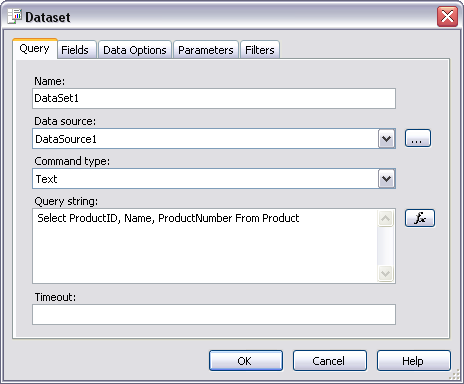
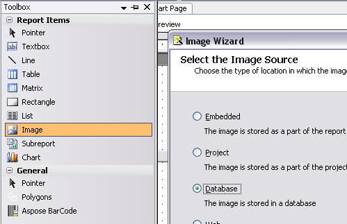
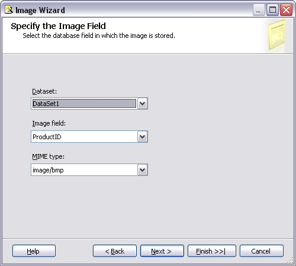
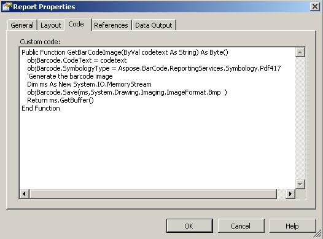
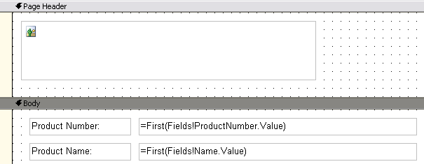
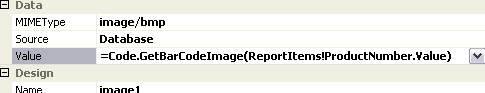
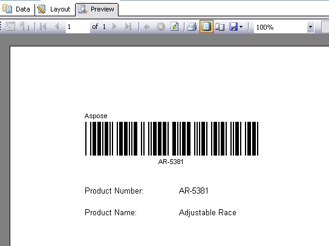

{} 

This tutorial covers how to display barcodes in a report header.

{} 
### **Problem**
In Visual Studio, you cannot use a custom control in headers or footers. Since Aspose.BarCode for Reporting Services is a control this means that you cannot drag and drop the control to the header to display a barcode there. The good news is that you can use images in report headers and footers. This tutorial shows how to use the image control to render barcode images using Aspose.BarCode for Reporting Services.
### **Solution**
1. Create a Report Server project in Visual Studio 2005.
1. Add a new “Shared Data Source”. In this example, we will use “AdventureWorks” database.
1. Add a new blank report to the project.
1. Create a new **DataSet** for the report.
   Give the following SQL query in the **Query String** field. 

**SQL**



 Select ProductID, Name, ProductNumber From Product



**Defining the dataset** 

1. Click **OK** to save the dataset.
1. Add an image control to the report header: 
   1. To view the header, switch to layout view.
   1. Select **Report**, then **Page Header**.
   1. From the Visual Studio toolbox, drag an Image control to the header.
   1. Select **Database** as the **Image Source**.

      **Setting the image source** 

1. Click **Next**.
1. From **DataSet**, select the dataset that you just created for the report.
1. Select **ProductNumber** for the **Image field**.
   Use the ProductNumber column as the source for the codetext used to generate the barcode. 
1. In **MIME type**, select **image/bmp**.

   **The Image Wizard** 

1. Click **Finish** to exit the wizard.
1. Add a reference to the Aspose.BarCode.ReportingServices.dll: 
   1. Select **Report**, then **Report Properties**.
   1. Click the References tab.
   1. Browse to the Aspose.BarCode.ReportingServices.dll and add it to the references.
   1. A reference to System.Drawing dll is also required, which can be found in the .NET tab.
   1. On the Classes tab, add the description for the class as follows:
      Class Name:Aspose.BarCode.ReportingServices.BarCodeBuilderInstance Name: objBarCode

      **Adding the class description** 

1. Click the Code tab and add the following code: 

**VB.NET**



 Public Function GetBarCodeImage(ByVal codetext As String) As Byte()

objBarcode.CodeText = codetext

	objBarcode.SymbologyType = Aspose.BarCode.ReportingServices.Symbology.Code39Standard

	'Generate the barcode image

Dim ms As New System.IO.MemoryStream

objBarcode.Save(ms,System.Drawing.Imaging.ImageFormat.Bmp)

Return ms.GetBuffer()

End Function



**Adding custom code** 

1. Click **OK** to save the reference, class details and the code.
   So far, we have added the image and the code to generate the barcode.
1. Click **View** then **DataSets**.
1. Drag the ProductNumber and Name columns to the report body.
1. Add two textboxes to the body for the purpose of adding labels.
   The Report layout should look as follows:

   **Report layout** 

1. Right-click the image control and select **Properties**.
1. Set the value to =Code.GetBarCodeImage(ReportItems!ProductNumber.Value)

   **Setting the data value** 

Save all the files and click on “Preview” tab. You should see the similar output as below:

**The final report** 

If you cannot see the barcode, click the **Print Layout** icon on the toolbar. This shows the report with the header and footer.
