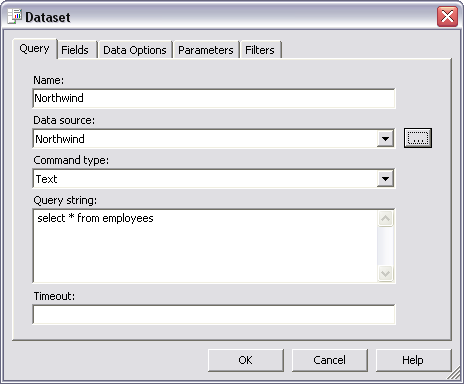
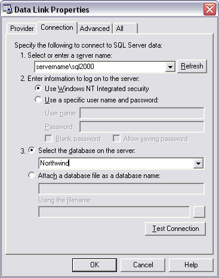
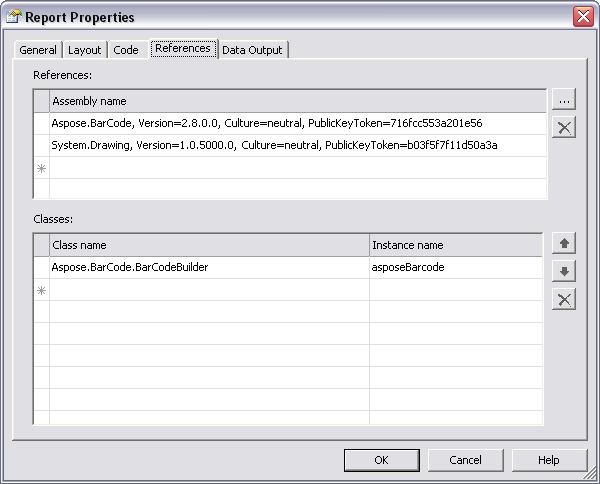
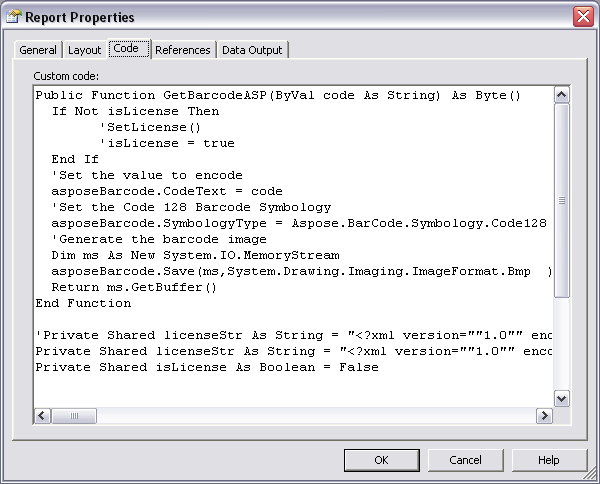
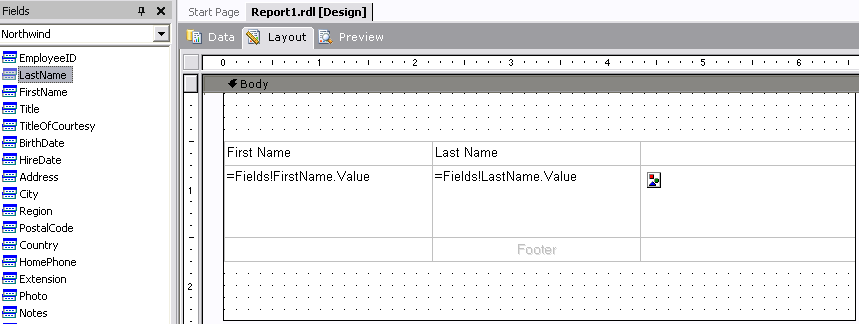
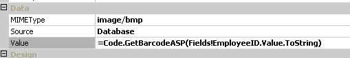
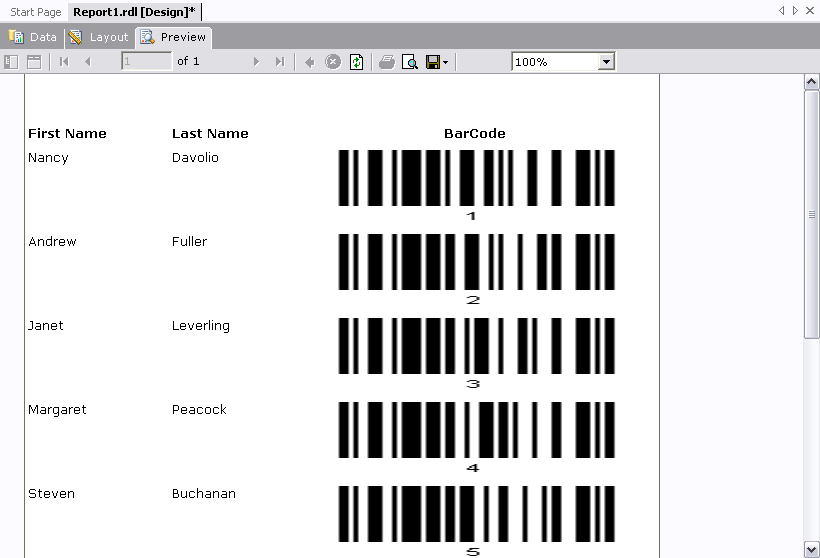

{} 

This article is intended for customers who want to use Aspose.BarCode with Visual Studio 2003 and SQL Server Reporting Services 2000. Please refer to the [Quick Start](/barcode/reportingservices/quick-start-tutorial-html/) article if you are going to use Aspose.BarCode with Visual Studio 2005 or later and SQL Server Reporting Services 2005 or later.

{} 

There are some limitations to making custom controls for SQL Server 2000 Reporting Services (lack of support for design time features, for example), which makes working with barcodes on SQL Server 2000 Reporting Services a little complex compared to working with Aspose.BarCode on SQL Reporting Services 2005/2008.

{} 

Aspose.BarCode for Reporting Services currently works with SQL Server Reporting Services 2005 and 2008. To make it work with SQL Server Reporting Services 2000, use [Aspose.BarCode for .NET](http://www.aspose.com/categories/visual-components/aspose.barcode-for-.net-and-java/default.aspx).

Aspose.BarCode had been developed for all of the platforms we support. This article discusses two of the Aspose.BarCode products:

1. Aspose.BarCode for Reporting Services: works with SQL Server Reporting Services 2005/2008.
1. Aspose.BarCode for .NET: designed for programming in .NET frameworks 1.1, 2.x and 3.x and SQL Server Reporting Services 2000.

We need to have following environment for using Aspose.BarCode with Reporting Services 2000.

- .NET Framework 1.1
- SQL Server Reporting Services 2000 sp2
- Microsoft Visual Studio 2003
- Aspose.BarCode for .NET (The example here uses the DLL for .NET 1.1)

This article explains how to [set up](/barcode/reportingservices/how-to-use-aspose-barcode-in-sql-server-reporting-services-2000-html/) Aspose.BarCode for .NET for use with SSRS 2000 and shows how to use it in a [simple project](/barcode/reportingservices/how-to-use-aspose-barcode-in-sql-server-reporting-services-2000-html/).

{} 
### **Setting Up Aspose.BarCode for SQL Server Reporting Services 2000**
1. Copy the Aspose.BarCode.dll to the following SQL Server Reporting Services install directories: 
   1. X:\Program Files\Microsoft SQL Server\MSSQL\Reporting Services\ReportServer\bin
   1. X:\Program Files\Microsoft SQL Server\80\Tools\Report DesignerOpen Program Files\Microsoft SQL Server\80\Tools\Report Designer
      You will find the **rspreviewpolicy.config** file.
1. Open **rspreviewpolicy.config** in any text editor and add the following lines into the <CodeGroup> element? 

**XML**



 <policy>

<PolicyLevel version="1">

    .......

        <CodeGroup class="FirstMatchCodeGroup" version="1" PermissionSetName="Nothing">

        ........

            <!-- Start config for Aspose.BarCode for Reporting Services-->

	<CodeGroup class="UnionCodeGroup" version="1" PermissionSetName="FullTrust" Name="AsposeBarCode" Description="Aspose.BarCode for Reporting Services ">

                <IMembershipCondition class="StrongNameMembershipCondition" version="1" PublicKeyBlob="00240000048000009400000006020000002400005253413100040000010001005542E99CECD28842DAD186257B2C7B6AE9B5947E51E0B17B4AC6D8CECD3E01C4D20658C5E4EA1B9A6C8F854B2D796C4FDE740DAC65E834167758CFF283EED1BE5C9A812022B015A902E0B97D4E95569EB8C0971834744E633D9CB4C4A6D8EDA03C12F486E13A1A0CB1AA101AD94943236384CBBF5C679944B994DE9546E493BF" />

            </CodeGroup>

            <!-- End of config -->

        </CodeGroup>

    </PolicyLevel>

</policy>



1. Browse to the Program Files\Microsoft SQL Server\MSSQL\Reporting Services\ReportServer folder.
1. Open the **rssrvpolicy.config** file in a text editor.
1. Add the folliwing lines to **rssrvpolicy.config**. 

**XML**



 <policy>

<PolicyLevel version="1">

    .......

        <CodeGroup class="FirstMatchCodeGroup" version="1" PermissionSetName="Nothing">

        ........

            <!-- Start config for Aspose.BarCode for Reporting Services-->

            <CodeGroup class="UnionCodeGroup" version="1" PermissionSetName="FullTrust" Name="AsposeBarCode" Description="Aspose.BarCode for Reporting Services">

                <IMembershipCondition class="StrongNameMembershipCondition" version="1" PublicKeyBlob="00240000048000009400000006020000002400005253413100040000010001005542E99CECD28842DAD186257B2C7B6AE9B5947E51E0B17B4AC6D8CECD3E01C4D20658C5E4EA1B9A6C8F854B2D796C4FDE740DAC65E834167758CFF283EED1BE5C9A812022B015A902E0B97D4E95569EB8C0971834744E633D9CB4C4A6D8EDA03C12F486E13A1A0CB1AA101AD94943236384CBBF5C679944B994DE9546E493BF" />

            </CodeGroup>

            <!-- End of config -->

        </CodeGroup>

    </PolicyLevel>

</policy>



After copying **Aspose.BarCode.dll** to the SQL Server Reporting Services 2000 folders and modified the config files, [create a simple project](/barcode/reportingservices/how-to-use-aspose-barcode-in-sql-server-reporting-services-2000-html/) in Visual Studio 2003 Report Project and include a barcode.

The default location of **Aspose.BarCode.dll** is C:\Program Files\Aspose\Aspose.BarCode\Bin\net1.1.
### **Using Aspose.BarCode for .NET with SQL Server Reporting Services 2000**
1. Open Visual Studio 2003.
1. Create a new project of the **Business Intelligence Projects** and **Report Project** type.
1. Add a new report to this project: 
   1. In the Solution Explorer, right-click **Reports** and select **Add**, then **Add New Item**.
   1. Select **Report** from the templates.
1. Add a new dataset to the report by selecting **<New Dataset>** from the **Dataset** list. 

   **Adding a dataset** 

1. Set the name to Northwind.
1. From the **DataSource** list, select **New Data Source**.
1. Select your SQL Server 2000 instance and the Northwind database.
1. Make sure that you see the “Connection successful” message when you click **Test Connection**.
1. Type this SQL query into the **Query string** field: 

   “SELECT * FROM Employees” 
1. Click **OK**. 

   **The Data Link Properties dialog** 

1. Select **Report** and then **Report Properties**.
1. Go to the **References** tab and add references to the following dlls: 
   1. Aspose.BarCode.dll (default location is is C:\Program Files\Aspose\Aspose.BarCode\Bin\net1.1)
   1. Select System.Drawing from the **Add Reference** from the **.NET** tab. 

      **The References tab** 

1. In the **Classes** section, add the class name Aspose.BarCode.BarCodeBuilder.
1. Add asposeBarcode to the corresponding instance name. 

   We will use the asposeBarcode instance in the **Code** tab to render barcodes in Reporting Services.
1. Select the **Code** tab and add the following lines of VB.NET: 

**VB.NET**



 Public Function GetBarcodeASP(ByVal code As String) As Byte()

If Not isLicense Then

	SetLicense()

	isLicense = true

  End If

  'Set the value to encode

  asposeBarcode.CodeText = code

  'Set the Code 128 Barcode Symbology

  asposeBarcode.SymbologyType = Aspose.BarCode.Symbology.Code128

  'Generate the barcode image

  Dim ms As New System.IO.MemoryStream

  asposeBarcode.Save(ms,System.Drawing.Imaging.ImageFormat.Bmp  )

  Return ms.GetBuffer()

End Function



**[VB.NET]**



 Private Shared licenseStr As String = "<?xml version=""1.0""  ............  </License>"

Private Shared isLicense As Boolean = False

Private Sub SetLicense()

        Dim ms As New System.IO.MemoryStream 

        Dim sw As New System.IO.StreamWriter(ms) 

        sw.Write(licenseStr) 

        sw.Flush() 

        Dim lic As New Aspose.BarCode.License 

        ms.Position = 0 

        lic.SetLicense(ms) 

End Sub



1. If you have a valid license file, please open it in a text editor, copy its contents and paste it as the value of the licenseStr variable.
1. If using a trial version, comment out the license code. 

   **License inclusion commented out** 

We will call the GetBarcodeASP function in the value field of the barcode image.

1. From the Toolbox, drag a new table to the report's **Layout** pane. 
   You will see three rows: header, detail and footer, automatically added to the table.
1. From **Fields**, drag **First Name** and **Last Name** to the detail row. 

   **Adding the name** 

1. To the 3rd column, add an image from the Toolbox.
1. Click the image and select **Properties**.
1. Select **image/bmp** from the **MIMEType** list.
1. Select **Database** as the source.
1. Set = Code.GetBarcodeASP(Fields!EmployeeID.Value.ToString) as the value. 
   GetBarcodeASP() is the method that we wrote in the **Code** tab. We are passing the EmployeeID as the CodeText for which the barcode will be generated. You can pass any valid value that you want togenerate a barcode for as an argument in this function. 

   **Setting the CodeText** 

1. Click **Preview**. 
   You should see a report preview similar to the screenshot below. 

   **The output report** 

### **Resources**
{} 

- [Download Aspose.BarCode for Reporting Services](http://www.aspose.com/community/files/52/ssrs-rendering-extensions/aspose.barcode-for-reporting-services/default.aspx)
- [Support forums](http://www.aspose.com/community/forums/aspose.barcode-product-family/193/showforum.aspx)

{}
