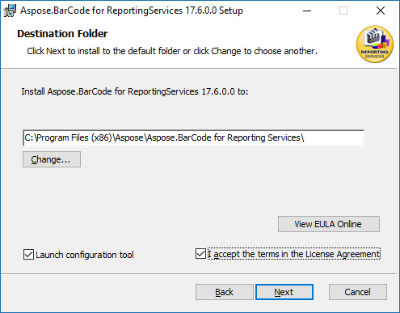
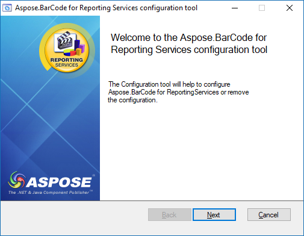
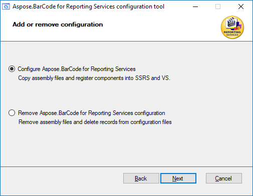
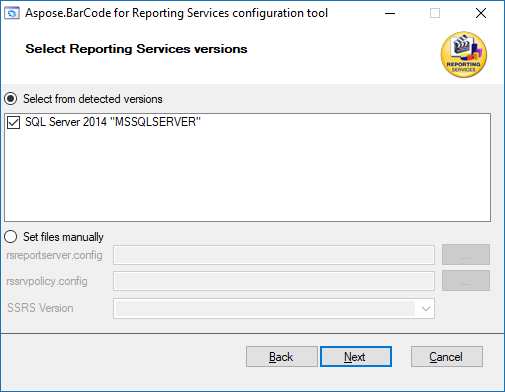
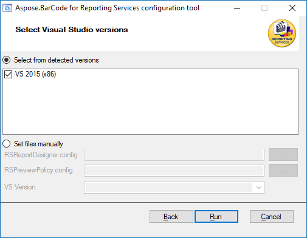
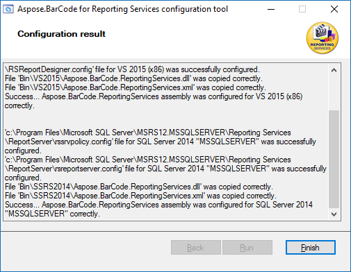

{} 

This help topic briefs the way to use configuration tool to automate the Aspose.BarCode configuration process.

{} 
## **Aspose.BarCode for SSRS Configuration Tool**
Aspose.BarCode for Reporting Services enables you to configure Aspose.BarCode in an easy and in a very convenient way by using a confiuratoin tool. Current configuration procedure is not a simple one to carry out. Lot of file manipulation is involved that includes file copying, editing config. files etc. Aspose.BarCode for SSRS intorduced a configuration tool that will automatically configure the Aspose.BarCode for you on your machine by detecting the MS SQL Server version and MS Visiual Studio installed.

Following is the step by step procedure:

- **Step #1**: Select the installation path.

- **Step #2**: Welcome screen.

- **Step #3**: Add or remove configuration screen.

- **Step #4**: Setup will detect MS SQL Server reporting services version and ask for your choice. Manual file setup is also available.

- **Step #5**: Setup will detect MS Visual Studio version and ask for your choice. Manual file setup is also available.

- **Step #6**: Installation summary.

