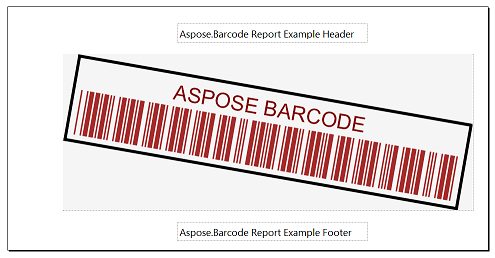
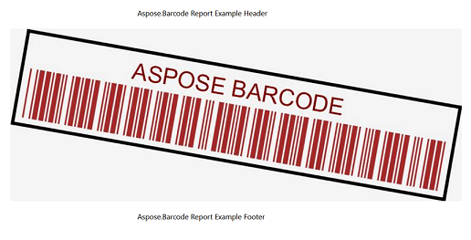
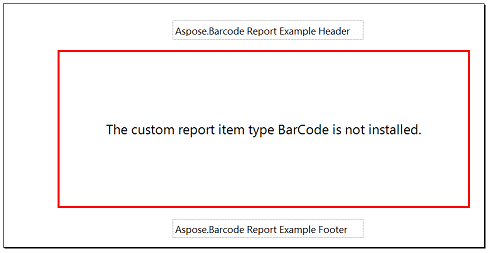
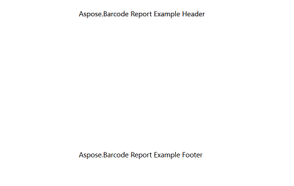
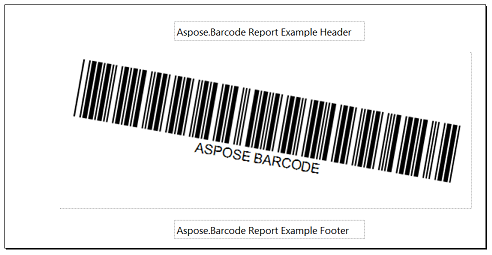
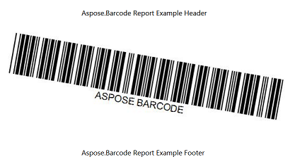
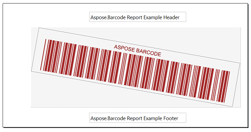
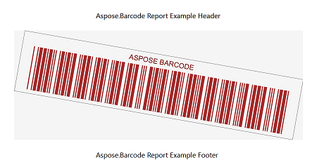

## **Overview**

In this section we overview how to migrate from obsolete ***Barcode Visual Component***, which is used in [***Aspose.Barcode for Reporting Services***](https://releases.aspose.com/barcode/reportingservices/) 20.6 and previous versions, to ***BarcodeGenerator Visual Component***, which is used in ***Aspose.Barcode for Reporting Services*** 21.3 and newer versions.

***BarcodeGenerator Visual Component*** is a wrapper around [***BarcodeGenerator*** class](https://reference.aspose.com/barcode/net/aspose.barcode.generation/barcodegenerator/) and ***BarcodeGenerator*** has some major differences in render architecture from ***BarCodeBuilder***, which is used in ***Barcode Visual Component***. Therefore, we renamed Reporting Services visual component to ***BarcodeGenerator*** and replaced property structure, which mirrors ***BarcodeGenerator*** class properties.

This can lead to the situation when barcode components from previously created reports can disappear. This article describes what need to be changed to add support of barcode rendering to old reports with new ***BarcodeGenerator Visual Component***.

In case of using ***BarCodeBuilder*** builder in Custom Code of previous reports you can render barcode image with [***BarcodeGenerator*** class](/barcode/reportingservices/barcodegenerator-class/).

## **Report with obsolete Barcode Visual Component**

As an example, we created project with obsolete ***Barcode Visual Component*** which you can [download](vsrep2019_old.zip). The visual representation you can see in the table:

| **Visual Studio Design Image** | **SQL Server Reporting Services Image** |
| :- | :- |
|  |  |

## **Error with report opening with Barcode Visual Component**

In case of opening of the project with obsolete ***Barcode Visual Component*** in ***Visual Studio*** or ***SQL Server Reporting Services*** with installed ***BarcodeGenerator Visual Component*** you can see the following error message or just blank image on the place of the barcode.

| **Visual Studio Design Image With Error** | **SQL Server Reporting Services Image With Error** |
| :- | :- |
|  |  |

## **How to fix report**

You can fix the issue in two ways:
- rename ***Barcode*** type in all of barcode reports components to ***BarcodeGenerator***;
- add ***Barcode*** component mapping to configuration files.

Both of these ways make your reports workable with basic parameters like Barcode Type or CodeText. To setup other parameters you can manually change the component parameters names or just set up them in the ***Property*** window.

| **Visual Studio Design Image Fixed** | **SQL Server Reporting Services Image Fixed** |
| :- | :- |
|  |  |

### **Replace Barcode to BarcodeGenerator**

The simplest way to resolve this problem is directly opening ***“x.rdl”*** report code and manually rename the component type from ***Barcode*** to ***BarcodeGenerator***. However, you have to do this for every ***Barcode*** component in any old report.

<Report>
	<ReportSections>
		<ReportSection>
			<Body>
				<ReportItems>
					<CustomReportItem Name="BarCode1">
						<!-- Replace BarCode to BarcodeGenerator-->
						<Type>BarcodeGenerator</Type>
					</CustomReportItem>
				</ReportItems>
			</Body>
		</ReportSection>
	</ReportSections>
</Report>


### **Add Barcode to config files**

Other way, you can manually add ***Barcode*** component mapping to ***Visual Studio*** and ***SQL Server Reporting Services*** configuration files. 

For ***Visual Studio*** you need to add the following code to:
- ***RSReportDesigner.config***

<Configuration>
	<Extensions>
		<ReportItemDesigner>
			<ReportItem Name="BarcodeGenerator" Type="Aspose.BarCode.ReportingServices.BarCodeReportItemDesigner, Aspose.BarCode.ReportingServices"/>
		</ReportItemDesigner>
		<ReportItems>
			<ReportItem Name="BarcodeGenerator" Type="Aspose.BarCode.ReportingServices.BarCodeReportItem, Aspose.BarCode.ReportingServices"/>
		</ReportItems>
		<ReportItemDesigner>
			<ReportItem Name="BarCode" Type="Aspose.BarCode.ReportingServices.BarCodeReportItemDesigner, Aspose.BarCode.ReportingServices"/>
		</ReportItemDesigner>
		<ReportItems>
			<ReportItem Name="BarCode" Type="Aspose.BarCode.ReportingServices.BarCodeReportItem, Aspose.BarCode.ReportingServices"/>
		</ReportItems>
	</Extensions>
</Configuration>

- ***RSPreviewPolicy.config***

<configuration>
	<mscorlib>
		<security>
			<policy>
				<PolicyLevel version="1">
					<CodeGroup class="FirstMatchCodeGroup" version="1" PermissionSetName="Nothing">
						<CodeGroup class="FirstMatchCodeGroup" version="1" PermissionSetName="Execution" Description="This code group grants MyComputer code Execution permission. ">
							<CodeGroup class="UnionCodeGroup" version="1" PermissionSetName="FullTrust" Name="BarcodeGenerator" Description="Aspose.BarCode for Reporting Services">
								<IMembershipCondition class="StrongNameMembershipCondition" version="1" PublicKeyBlob="0x00240000048000009400000006020000002400005253413100040000010001005542E99CECD28842DAD186257B2C7B6AE9B5947E51E0B17B4AC6D8CECD3E01C4D20658C5E4EA1B9A6C8F854B2D796C4FDE740DAC65E834167758CFF283EED1BE5C9A812022B015A902E0B97D4E95569EB8C0971834744E633D9CB4C4A6D8EDA03C12F486E13A1A0CB1AA101AD94943236384CBBF5C679944B994DE9546E493BF"/>
							</CodeGroup>
							<CodeGroup class="UnionCodeGroup" version="1" PermissionSetName="FullTrust" Name="BarCode" Description="Aspose.BarCode for Reporting Services ">
								<IMembershipCondition class="StrongNameMembershipCondition" version="1" PublicKeyBlob="0x00240000048000009400000006020000002400005253413100040000010001005542E99CECD28842DAD186257B2C7B6AE9B5947E51E0B17B4AC6D8CECD3E01C4D20658C5E4EA1B9A6C8F854B2D796C4FDE740DAC65E834167758CFF283EED1BE5C9A812022B015A902E0B97D4E95569EB8C0971834744E633D9CB4C4A6D8EDA03C12F486E13A1A0CB1AA101AD94943236384CBBF5C679944B994DE9546E493BF"/>
							</CodeGroup>
						</CodeGroup>
					</CodeGroup>
				</PolicyLevel>
			</policy>
		</security>
	</mscorlib>
</configuration>


For ***SQL Server Reporting Services*** you need to add the following code to:
- ***rsreportserver.config***

<Configuration>
	<Extensions>
		<ReportItems>
			<ReportItem Name="BarcodeGenerator" Type="Aspose.BarCode.ReportingServices.BarCodeReportItem, Aspose.BarCode.ReportingServices"/>
		</ReportItems>
		<ReportItems>
			<ReportItem Name="BarCode" Type="Aspose.BarCode.ReportingServices.BarCodeReportItem, Aspose.BarCode.ReportingServices"/>
		</ReportItems>
	</Extensions>
</Configuration>

- ***rssrvpolicy.config***

<configuration>
	<mscorlib>
		<security>
			<policy>
				<PolicyLevel version="1">
					<CodeGroup class="FirstMatchCodeGroup" version="1" PermissionSetName="Nothing">
						<CodeGroup class="FirstMatchCodeGroup" version="1" PermissionSetName="Execution" Description="This code group grants MyComputer code Execution permission. ">
							<CodeGroup class="UnionCodeGroup" version="1" PermissionSetName="FullTrust" Name="BarcodeGenerator" Description="Aspose.BarCode for Reporting Services">
								<IMembershipCondition class="StrongNameMembershipCondition" version="1" PublicKeyBlob="00240000048000009400000006020000002400005253413100040000010001005542E99CECD28842DAD186257B2C7B6AE9B5947E51E0B17B4AC6D8CECD3E01C4D20658C5E4EA1B9A6C8F854B2D796C4FDE740DAC65E834167758CFF283EED1BE5C9A812022B015A902E0B97D4E95569EB8C0971834744E633D9CB4C4A6D8EDA03C12F486E13A1A0CB1AA101AD94943236384CBBF5C679944B994DE9546E493BF"/>
							</CodeGroup>
							<CodeGroup class="UnionCodeGroup" version="1" PermissionSetName="FullTrust" Name="BarCode" Description="Aspose.BarCode for Reporting Services ">
								<IMembershipCondition class="StrongNameMembershipCondition" version="1" PublicKeyBlob="00240000048000009400000006020000002400005253413100040000010001005542E99CECD28842DAD186257B2C7B6AE9B5947E51E0B17B4AC6D8CECD3E01C4D20658C5E4EA1B9A6C8F854B2D796C4FDE740DAC65E834167758CFF283EED1BE5C9A812022B015A902E0B97D4E95569EB8C0971834744E633D9CB4C4A6D8EDA03C12F486E13A1A0CB1AA101AD94943236384CBBF5C679944B994DE9546E493BF"/>
							</CodeGroup>
						</CodeGroup>
					</CodeGroup>
				</PolicyLevel>
			</policy>
		</security>
	</mscorlib>
</configuration>


## **Mapping of the main properties**

***Barcode*** and ***BarcodeGenerator Visual Components*** have custom properties which can have different names but can do the same. The properties can be manually edited in CustomProperties RDL code or setup by ***Property*** window of ***BarcodeGenerator*** component. We provide the table which describe the properties from both components, their values and descriptions.

{} 
In case of property has default value, the property is removed from CustomProperties and default value is used.
{} 

| **Barcode** | **BarcodeGenerator** | **Value example** | **Description** |
| :- | :- | :- | :- |
| _codeText | _codeText | ASPOSE BARCODE | Encoded CodeText of the barcode. |
| _encodeType | _encodeType | Code39Extended | Barcode Type. |
| _RenderFormat | _RenderFormat | Jpeg | Image format |
| _backgroundColor | _backColor | WhiteSmoke | Color of the barcode background. |
| _foreColor | _barcode_BarColor | Brown | Color of the barcode. |
| _codeLocation | _codeTextParameters_Location | Above | CodeText location. |
| _codeTextFont | _codeTextParameters_FontMode   _codeTextParameters_Font | Manual   Arial, 10pt | Font rendering mode: manual or automatic, font size in manual mode. |
| _codeTextColor | _codeTextParameters_Color | Maroon | Color of CodeText |
| _rotationAngle | _rotationAngle | 10 | Rotation Angle of the barcode. |
| _dpiX, _dpiY | _resolution | 300 | Barcode resolution. The best for printing is 300 or 600 dpi. |
| _borderColor | _border_Color | Black | Color of the barcode border. |
| _borderVisible | _border_Visible   _border_Width | True   1px | Set the barcode border visibility state and size of the border. |

## **Final migration result**

The fully fixed barcode you can [download](vsrep2019_edited.zip) and view the rendering result in the following table:

| **Visual Studio Design Migrated Image** | **SQL Server Reporting Services Migrated Image** |
| :- | :- |
|  |  |
