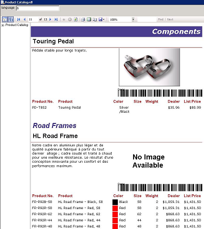

## **Overview**
This gallery shows a few examples of barcode images that have been rendered to Microsoft SQL Server reports by Aspose.BarCode for Reporting Services.

Most of the reports shown here come from the AdventureWorks database. AdventureWorks is a sample database for Microsoft SQL Server, [available for download from Microsoft](https://docs.microsoft.com/sql/samples/adventureworks-install-configure). 

## **Product Catalog**
It's easy to add barcodes in product catalogs to represent each product. 

### **Barcodes in a product catalog - accessories** 

### **Barcodes in a product catalog - bikes** 

## **Sales Order Detail**
Barcodes can also be added to your sales orders.

### **Barcodes in a sales order** 

