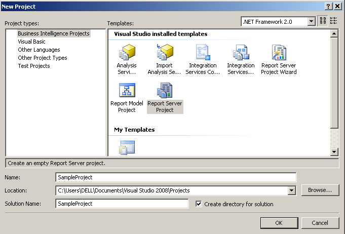
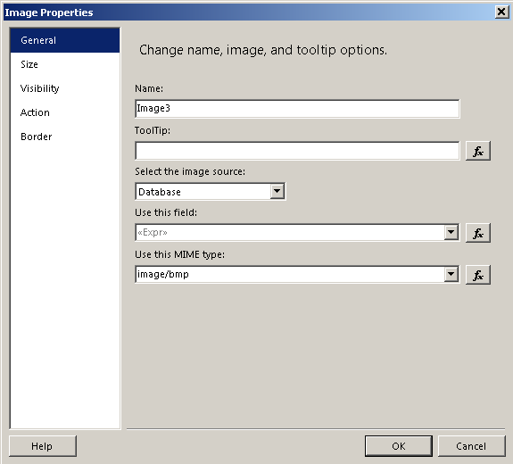
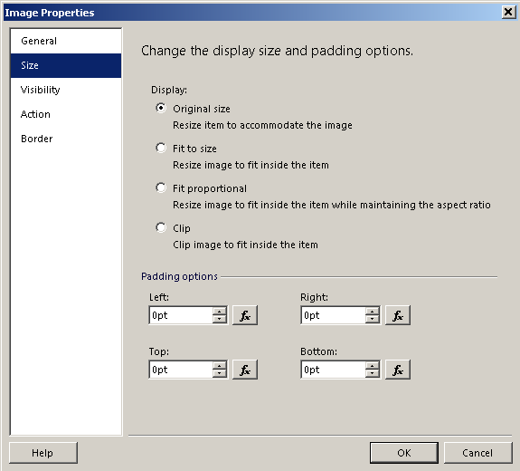
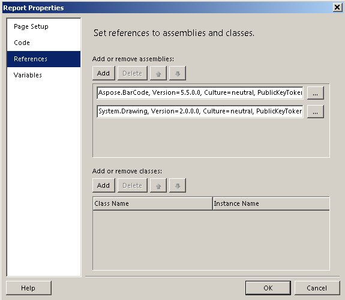
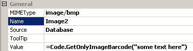
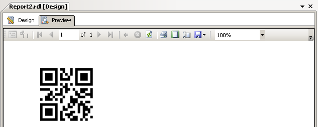

{} 

This article is intended for customers who require to use custom library of Aspose.BarCode for .NET in reporting services to adjust the bar code size.

{} 
### **Using Aspose.BarCode for .NET with SQL Server Reporting Services 2008**
1. Open Visual Studio 2008.
1. Create a new project of the **Business Intelligence Projects** and **Report Server Project** type.
1. Add a new report to this project: 
   1. In the Solution Explorer, right-click **Reports** and select **Add**, then **Add New Item**.
   1. Select **Report** from the templates.
1. New Project Window 

1. Now drag an image control in the report
1. In the **Image Properties** >> **General tab** >> Select the image source as database
1. Select **MIME Type** as image/bmp
1. Select **Size** as Original size 

1. Select **Report** and then **Report Properties**.
1. Go to the **References** tab and add references to the following dlls: 
   1. Aspose.BarCode.dll (default location is is C:\Program Files\Aspose\Aspose.BarCode\Bin\net2.0)
   1. Select System.Drawing from the **Add Reference** from the **.NET** tab. 

      **The References tab** 

1. Select the **Code** tab and add the following lines of VB.NET: 

1. **VB.NET**



 Private Sub SetLicense()

        Dim license As Aspose.BarCode.License = New Aspose.BarCode.License()

        license.SetLicense("c:\ab\Aspose.Total.Product.Family.lic")

End Sub

Public Function GetScaledImageBarcode(codetext as String) As Byte()

        SetLicense()

        Dim objBarcode As Aspose.BarCode.BarCodeBuilder = New Aspose.BarCode.BarCodeBuilder()

        objBarcode.CodeText = codetext

        objBarcode.SymbologyType = Aspose.BarCode.Symbology.QR

        objBarcode.Margins.Set(0)

        objBarcode.CodeLocation = Aspose.BarCode.CodeLocation.None

        objBarcode.GraphicsUnit = System.Drawing.GraphicsUnit.Pixel

        objBarcode.CaptionAbove.Visible = false

        objBarcode.CaptionBelow.Visible = false

        'Generate the barcode image

        Dim ms As New System.IO.MemoryStream

        objBarCode.GetCustomSizeBarCodeImage(new System.Drawing.Size(300, 300), true).Save(ms, System.Drawing.Imaging.ImageFormat.Bmp)

        Return ms.GetBuffer()

End Function

Public Function GetOnlyImageBarcode(codetext as String) As Byte()

        SetLicense()

        Dim objBarcode As Aspose.BarCode.BarCodeBuilder = New Aspose.BarCode.BarCodeBuilder()

        objBarcode.CodeText = codetext

        objBarcode.SymbologyType = Aspose.BarCode.Symbology.QR

        objBarcode.Margins.Set(0)

        objBarcode.CodeLocation = Aspose.BarCode.CodeLocation.None

        objBarcode.GraphicsUnit = System.Drawing.GraphicsUnit.Pixel

        objBarcode.CaptionAbove.Visible = false

        objBarcode.CaptionBelow.Visible = false

        'Generate the barcode image

        Dim ms As New System.IO.MemoryStream

        objBarCode.GetOnlyBarCodeImage(5).Save(ms, System.Drawing.Imaging.ImageFormat.Bmp)

        Return ms.GetBuffer()

End Function

Public Function GetBarcode(codetext as String) As Byte()

        SetLicense()

        Dim objBarcode As Aspose.BarCode.BarCodeBuilder = New Aspose.BarCode.BarCodeBuilder()

        objBarcode.CodeText = codetext

        objBarcode.SymbologyType = Aspose.BarCode.Symbology.Code39Standard

        'Generate the barcode image

        Dim ms As New System.IO.MemoryStream

        objBarcode.Save(ms, System.Drawing.Imaging.ImageFormat.Bmp)

        Return ms.GetBuffer()

End Function



1. Set value property as =Code.GetOnlyImageBarcode("some text here")
1. GetOnlyImageBarcode() is the method that we wrote in the **Code** tab. We are passing the CodeText for which the bar code will be generated. You can pass any valid value that you want to generate a bar code for as an argument in this function. 

   **Setting the CodeText** 

1. Click **Preview**. 
   You should see a report preview similar to the screenshot below. 

   **The output report** 

### **Resources**
- [Download Aspose.BarCode for Reporting Services](http://www.aspose.com/community/files/52/ssrs-rendering-extensions/aspose.barcode-for-reporting-services/default.aspx)
- [Support forums](http://www.aspose.com/community/forums/aspose.barcode-product-family/193/showforum.aspx)
