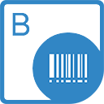

{}

**Welcome to Aspose.BarCode for SharePoint**

Aspose.BarCode for SharePoint is a flexible solution that allows you to add barcode type columns to SharePoint lists.

Aspose.BarCode for SharePoint is designed to be used with Microsoft SharePoint Server 2010. There are no additional system requirements.

{} 

## **Aspose.BarCode for SharePoint Resources**

Following are the links to some useful resources you may need to accomplish your tasks.

- [Aspose.BarCode for SharePoint Online Documentation](/barcode/sharepoint/)
- [Aspose.BarCode for SharePoint Features](/barcode/sharepoint/features/)
- [Aspose.BarCode for SharePoint Release Notes](/barcode/sharepoint/release-notes/)
- [Aspose.BarCode for SharePoint Product Page](https://products.aspose.com/barcode/sharepoint)
- [Download Aspose.BarCode for SharePoint](https://downloads.aspose.com/barcode/sharepoint)
- [Aspose.BarCode for SharePoint Free Support Forum](https://forum.aspose.com/c/barcode)
- [Aspose.BarCode for SharePoint Paid Support Helpdesk](https://helpdesk.aspose.com/)