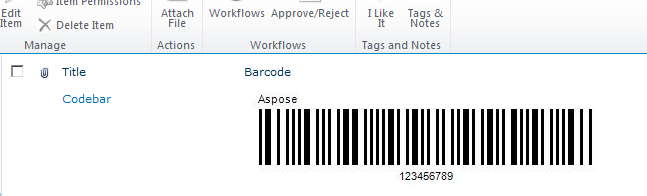

You can download an evaluation version of Aspose.BarCode for SharePoint from the [download page](https://releases.aspose.com/barcode/sharepoint/). The evaluation version provides the same capabilities as the licensed version of the barcode library. Furthermore, the evaluation version can be licensed by simply buying a license and after [applying a license](https://docs.aspose.com/barcode/sharepoint/applying-a-license/).

The evaluation version of Aspose.BarCode (that is, the application without a license applied) provides full barcode generation functionality but puts an evaluation watermark (the words Aspose) on the barcode image.

If you want to try Aspose.BarCode without evaluation version limitations, you can also request a 30-day temporary license. Please refer to [How to get a Temporary License?](http://www.aspose.com/corporate/purchase/temporary-license.aspx) for more information.
