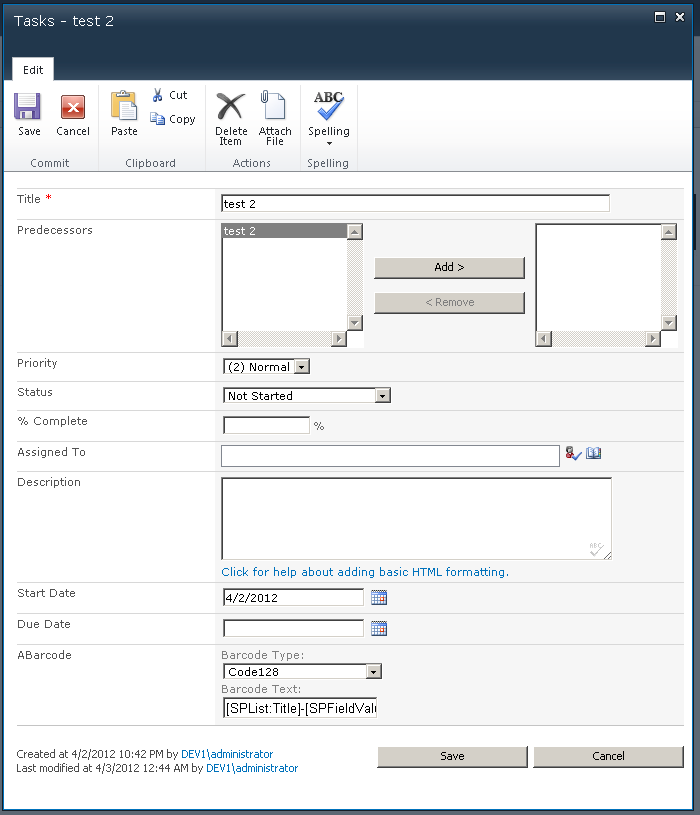
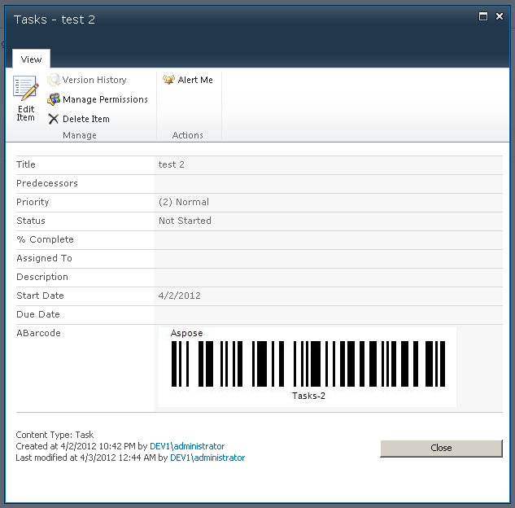
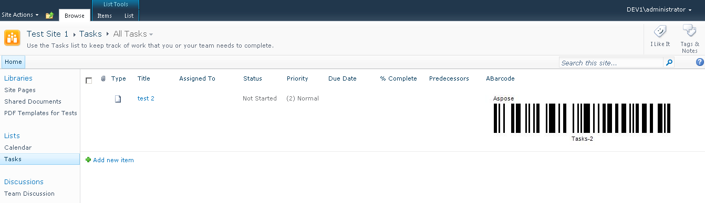

With Aspose.BarCode for SharePoint, you can add a barcode field to any list. The barcode field extends the existing SharePoint standard field set by adding a barcode field type. Use this field to generate barcodes in SharePoint lists. The barcode field requires two values as input to generate a barcode symbol:

- **Barcode type**: Can be selected from a list of supported symbologies. To get the complete list of supported symbologies, please read [Supported Barcode Symbologies](/barcode/sharepoint/supported-barcode-symbologies/).
- **Barcode text**: Specify any valid text for the selected symbology. If the text is invalid an error message is shown instead of the barcode label.

You can specify the barcode text as service markers, if you do not want to insert the barcode text manually. In this case, the barcode text is automatically populated according to the service marker. Please read more about how to [set service markers for a barcode value field](/barcode/sharepoint/set-service-markers-for-barcode-value-field/).

Once you have created a list with barcode column, you can add or edit item to fill the barcode field.

**Editing a barcode item** 

The screen shots below show the item in a list with a barcode label that was generated using the service marker [ SPList :Title ]-[ SPFieldValue:Priority ].

**Viewing the barcode** 

**The barcode label in the list** 

