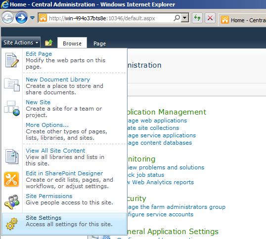
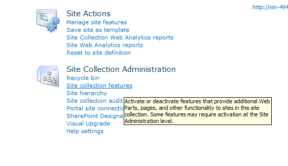
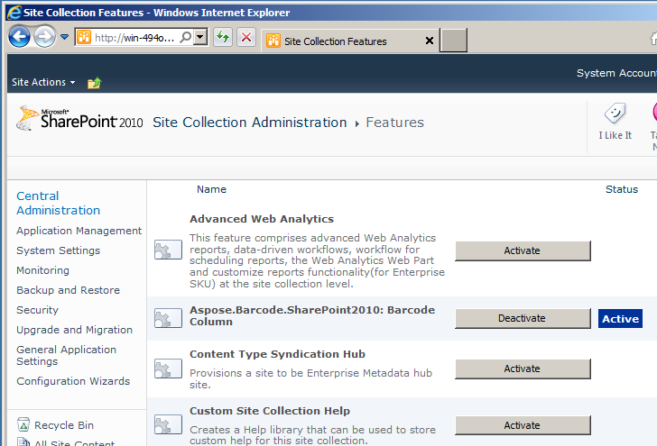

After installing Aspose.BarCode for SharePoint, activate the features at the root website. This article explains how to de-activate or activate Aspose.BarCodes.

The installation process automatically activate the Aspose.BarCode for SharePoint features. 

## **Accessing the Site Collection Features**
To activate or de-activate features:

1. Click the **Site Actions** menu and select **Site Settings**.

   **Selecting Site Settings** 

1. In the **Site Collection Administration** category, click **Site Collection Features**.

   **Accessing the site collection features** 

1. Click **Site Collection features** to open the page for activating or de-activating features.

   **Activate or de-activate Aspose.BarCode** 

