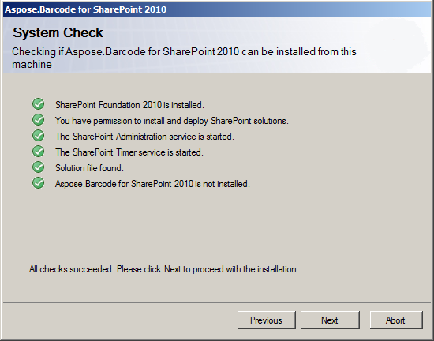
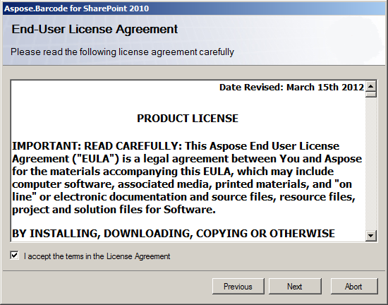
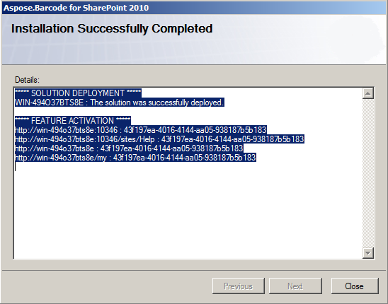

{} 

Aspose.BarCode for SharePoint is downloadable as Aspose.BarCode.SharePoint2010.zip archive. This archive contains the license agreement and installation files:

- **wsp file**: SharePoint solution file. Aspose.BarCode for SharePoint is packaged as a SharePoint solution to facilitate deployment/retraction across a server farm.
- **Aspose_LicenseAgreement.rtf**: End user license agreement.
- **Setup.exe**: Setup program.
- **Setup.exe.config**: Setup configuration file.

The setup program checks the following conditions before proceeding:

1. SharePoint Foundation 2010 is installed.
1. The user has permission to install SharePoint solutions.
1. SharePoint Foundation 2010 Administration service is started.
1. SharePoint Foundation 2010 Timer service is started.

The WSS Administration service and Timer services are needed because some setup actions rely on a timer job to propagate to all servers in the server farm.

{} 
### **Installation**
To install Aspose.BarCode for SharePoint:

1. Unpack Aspose.BarCode.SharePoint 2010.zip to the local drive on the SharePoint 2010 server.
1. Run Setup.exe and follow the instructions on the screen.
   The setup program performs the following actions: 
   1. Check installation prerequisites. Setup will not continue if any check fails.

      **Checking the installation prerequisites** 

1. Display End User License Agreement. The user must accept the agreement in order to proceed.

   **The EULA** 

1. Install and deploy the feature to the server farm.

   **The installation was successful** 

