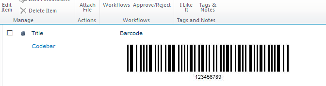

## **Overview**
The evaluation version of ***Aspose.BarCode for SharePOint*** can be used to generate barcode labels without restrictions. However, a watermark will be placed on the resulting barcode image (words “Aspose”). Moreover, the unlicensed version of the library allows reading all types of barcodes; however, only the *Code39* symbology can be used without limitations; for all other barcode types, 30% of the decrypted text will be masked with " * ". All other actions with barcodes through ***Aspose.BarCode for .NET*** require setting the license first. The license activates access to the entire functionality of the library so that you can perform barcode generation and recognition without any limitations and watermarks.  

## **How to Apply License**
To apply the license:

1. Place the .lic file in the C:\Program Files\Common Files\Microsoft Shared\Web Server Extensions\14\TEMPLATE\FEATURES\Aspose.Barcode.SharePoint.License folder
1. Run "iisreset" from a command prompt

The license file name must be one of "Aspose.Barcode.SharePoint.lic", "Aspose.Barcode Product Family.lic", "Aspose.Total for Sharepoint.lic" or "Aspose.Total Product Family.lic. 
  
To test a license that has been applied successfully:

1. Open any list that has Aspose.BarCode for SharePoint's barcode column.
   If you can no longer see “Aspose” on upper left side of the barcode label, the license has been applied.

   **Barcode created with a fully licensed installation of Aspose.BarCode** 

  

## **Evaluation Version**

You can download an evaluation version of Aspose.BarCode for SharePoint from the [download page](https://releases.aspose.com/barcode/sharepoint/). The evaluation version provides the same capabilities as the licensed version of the barcode library. Once you are happy with the evaluation, you can [buy a license](http://www.aspose.com/purchase/default.aspx). Then, full version can be enabled by activating the license.

The evaluation version of Aspose.BarCode (that is, the application without a license applied) provides full barcode generation functionality but puts an evaluation watermark (the words Aspose) on the barcode image.

If you want to try Aspose.BarCode without evaluation version limitations, you can also request a 30-day temporary license. Please refer to [How to get a Temporary License?](http://www.aspose.com/corporate/purchase/temporary-license.aspx) for more information.
