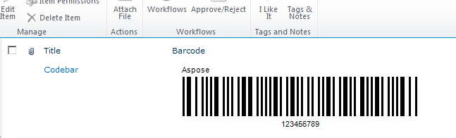

{} 

The evaluation version of Aspose.BarCode for SharePoint has no time limit and free technical support is available for evaluation users too.

{} 

The download for both evaluation and full versions of Aspose.BarCode for SharePoint is the same. Simply download Aspose.BarCode for SharePoint from the [download page](http://www.aspose.com/community/files/73/sharepoint-components/aspose.barcode-for-sharepoint/default.aspx) and install it. Aspose.BarCode works in evaluation mode by default.
### **Evaluation Version Limitations**
The evaluation version has only one limitation: “Aspose” appears on every barcode until a valid license is applied.

**Barcode created with the evaluation version of Aspose.BarCode** 

To use the full version, [apply a license](/barcode/sharepoint/applying-a-license-html/) or [request a 30 temporary license](http://www.aspose.com/corporate/purchase/temporary-license.aspx).
