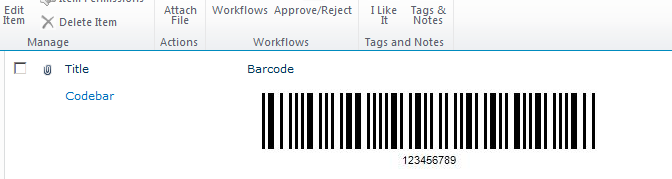

To test a license that has been applied successfully:

1. Open any list that has Aspose.BarCode for SharePoint's barcode column.
   If you can no longer see “Aspose” on upper left side of the barcode label, the license has been applied.

   **Barcode created with a fully licensed installation of Aspose.BarCode** 

{} 

[Find out what the evaluation limitations](/barcode/sharepoint/evaluation-version-limitations-html/) are.

{}
