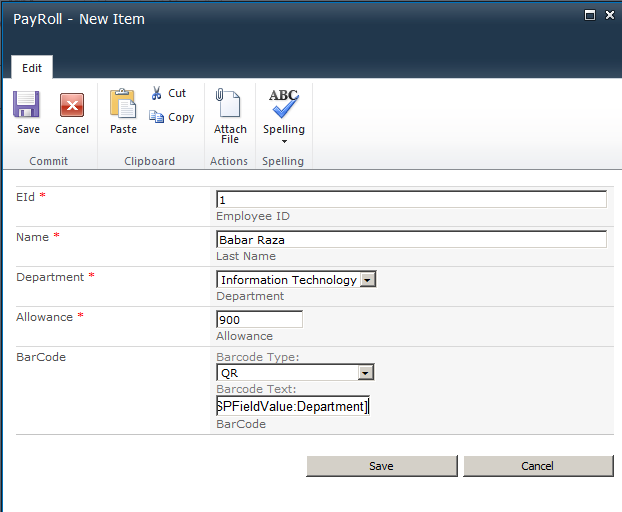
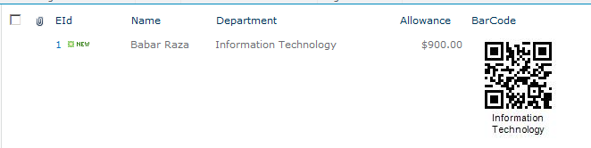

With Aspose.BarCode for SharePoint, you can insert service markers as the barcode value field. This allows the barcode field to automatically pick the value depending on the service marker. Also, this approach allows you to concatenate two or more values to generate a single label.

A few of such markers are listed below for illustration:

- [SPList:Title] – List title
- [SPList:ItemsCount] – Total number of items
- [SPFieldValue:<Field Display Name>] – Item field Value (that is [SPFieldValue:Priority])

Please check [Add Barcode Column to SharePoint lists](/barcode/sharepoint/add-barcode-column-to-sharepoint-lists/) for information on how to add a barcode field to a SharePoint custom list.

Assuming that the list already has a barcode column, we move forward to set the barcode’s code text using the service markers. Below is an example of a payroll list.

You may need to generate the barcode depending upon an employee’s department. For that you can use the [SPFieldValue:Department] marker.

The output is shown below.

