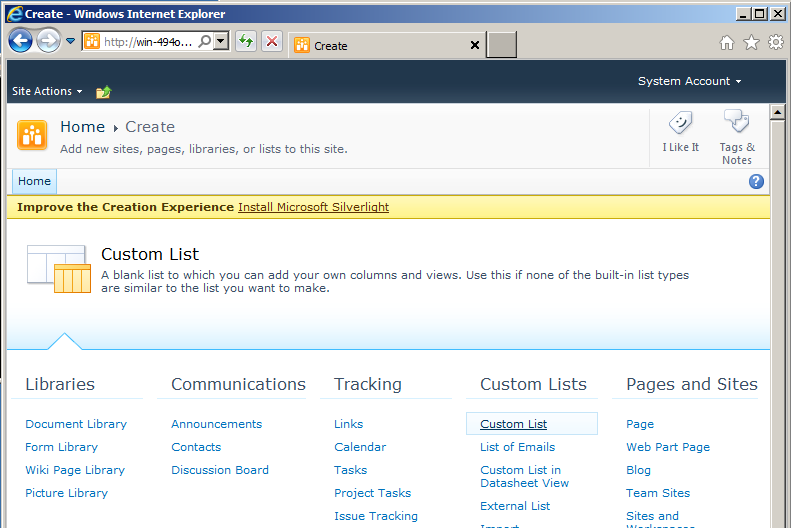
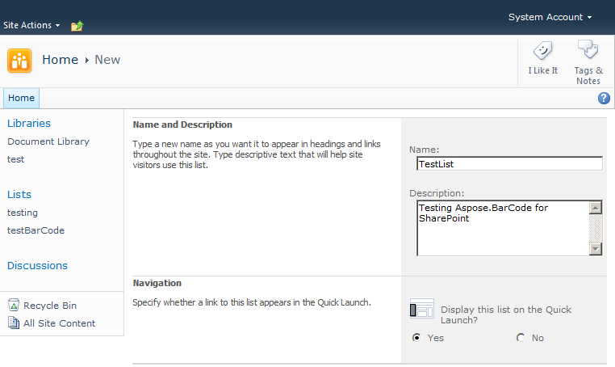
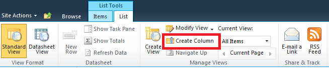
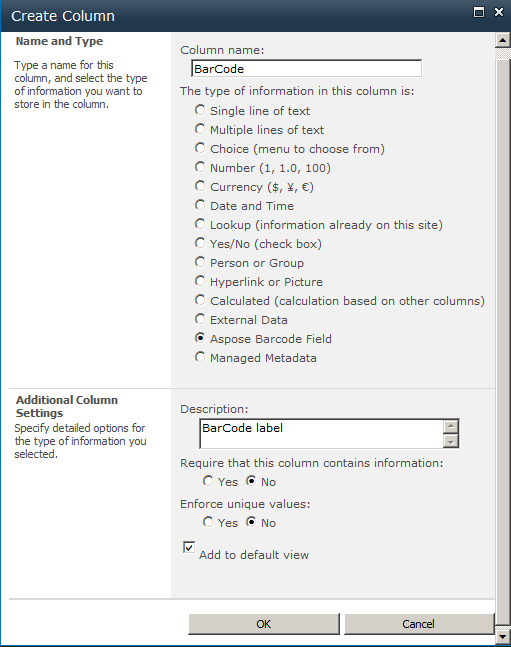
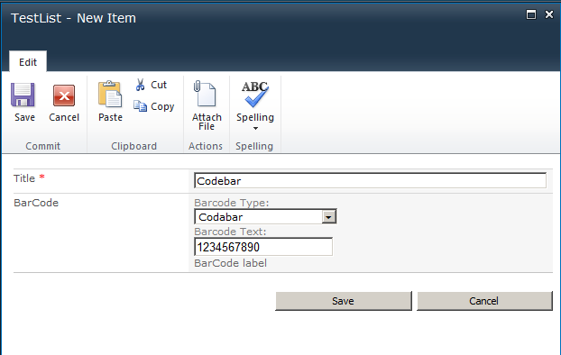
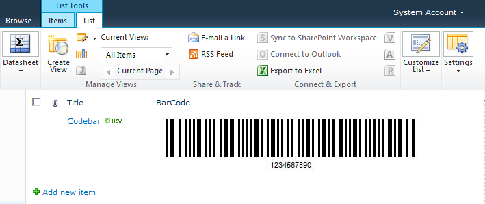

To use Aspose.BarCode for SharePoint, create a new custom list: 

1. On the **Create** page, select **Custom List**.

   **Creating a custom list** 

1. Provide a name and description for the new list.
1. Click **Create**.

   **Adding name and description** 

Once the list has been created, add columns to your list:

1. Click the **Create Column** on the ribbon.

   **Create a new column** 

1. To add a barcode column, select **Aspose BarCode field** from the list.
1. Provide a column name and description.
1. Click **OK**.

   **Creating a column** 

A barcode column has been added to the list. 

1. Now, add a new item by clicking **Add new item**.
   As there are only two columns in this list, the New item diagram looks like the one below.

   **New item** 

You can select different symbols for barcode generation and provide the barcode text. Once saved, the barcode will appear as below.

**A barcode in a SharePoint list** 

